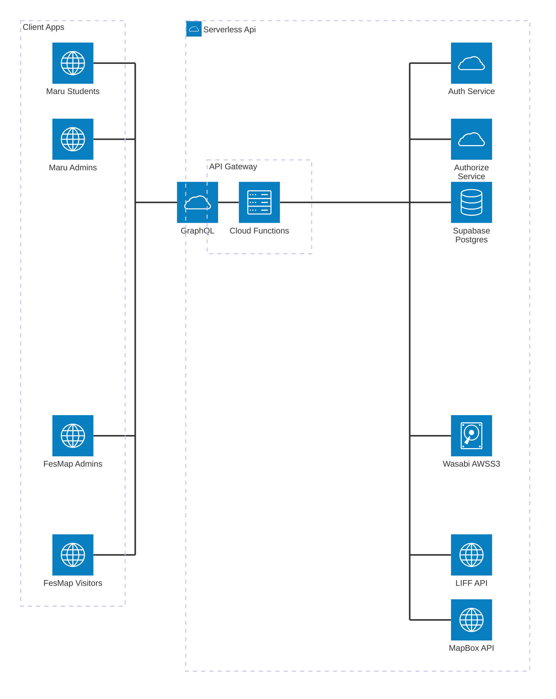

# fes-map

## アーキテクチャ図




## ディレクトリ構造

```
/fesmap
├── .git/ # Gitリポジトリ関連のファイル
├── .firebase/ # Firebase関連の設定ファイル
├── .github/ # GitHub関連の設定ファイル
├── circle-form/ # サークルフォーム関連のディレクトリ
├── functions/ # クラウドファンクション関連のコード
├── manage/ # 管理用のスクリプトやツール
├── user/ # ユーザー関連のデータやスクリプト
├── README.md # プロジェクトの概要と説明
├── firebase.json # Firebaseの設定ファイル
├── .firebaserc # Firebaseプロジェクトの設定
├── architecture.md # アーキテクチャに関する詳細な説明
├── Architecture.drawio # アーキテクチャ図のソースファイル
└── .gitignore # Gitで無視するファイルのリスト
```