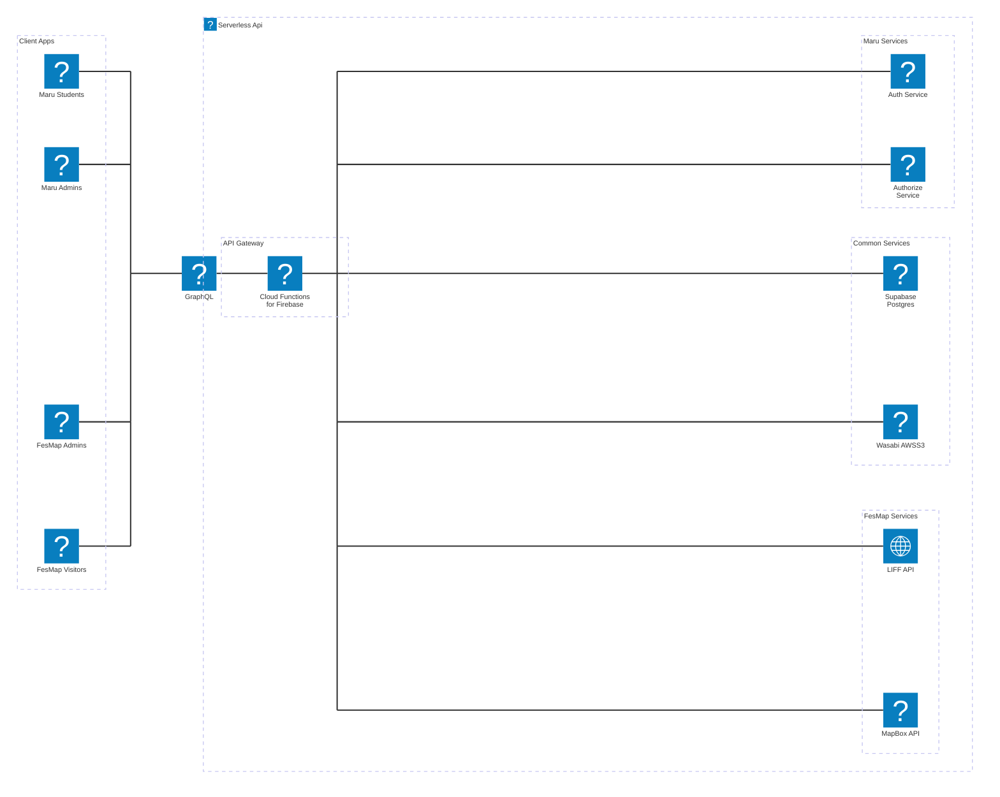

```mermaid
architecture-beta
    group client[Client Apps]
    service PrivateApi(logos:graphql)[GraphQL]

    service CAS(logos:flutter)[Maru Students] in client
    service CAA(logos:flutter)[Maru Admins] in client
    service FMA(logos:nextjs)[FesMap Admins] in client
    service FMV(logos:nextjs)[FesMap Visitors] in client

    group api(logos:firebase)[Serverless Api]
      group apiGw[API Gateway] in api
        service cloudFunctions(logos:google-cloud)[Cloud Functions for Firebase] in apiGw
      group MaruServices[Maru Services] in api
        service Auth(logos:firebase)[Auth Service] in MaruServices
        service Authorize(logos:firebase)[Authorize Service] in MaruServices
      group CommonServices[Common Services] in api
        service Supabase(logos:supabase-icon)[Supabase Postgres] in CommonServices
        service Wasabi(logos:aws-s3)[Wasabi AWSS3] in CommonServices
      group FesmapServices[FesMap Services] in api
        service Ext1(internet)[LIFF API] in FesmapServices
        service Ext2(logos:mapbox-icon)[MapBox API] in FesmapServices

    %%group mainApi(logos:aws-lambda)[Main Api] in api
      %%service UserInfo(database)[User Info] in mainApi
      %%service CircleInfo(database)[Circle Info] in mainApi
      %%service EventInfo(database)[Event Info] in mainApi
      %%service PavillionManage(database)[Pavillion Manage] in mainApi
      %%service VisitorActivity(database)[Visitors Activity] in mainApi
      %%service CircleSearch(database)[Circle Search] in mainApi
      %%service CircleSNS(database)[Circle SNS] in mainApi
      %%service VisitorDataAnalyse(database)[Visitor Data Analyse] in mainApi


  junction jAppsApi1
  junction jAppsApi2
  junction jAppsApic
  junction jAppsApi3
  junction jAppsApi4

  CAS:R -- L:jAppsApi1
  CAA:R -- L:jAppsApi2
  FMA:R -- L:jAppsApi3
  FMV:R -- L:jAppsApi4
  jAppsApi1:B -- T:jAppsApi2
  jAppsApi2:B -- T:jAppsApic
  jAppsApic:B -- T:jAppsApi3
  jAppsApi3:B -- T:jAppsApi4
  jAppsApic:R -- L:PrivateApi

  PrivateApi:R -- L:cloudFunctions


  junction jGwExt1
  junction jGwExt2
  junction jGwExt3
  junction jGwExt4
  junction jGwExt5
  junction jGwExt6

  Auth:L -- R:jGwExt1
  Authorize:L -- R:jGwExt2
  Supabase:L -- R:jGwExt3
  Wasabi:L -- R:jGwExt4
  Ext1:L -- R:jGwExt5
  Ext2:L -- R:jGwExt6

  jGwExt1:B -- T:jGwExt2
  jGwExt2:B -- T:jGwExt3
  jGwExt3:B -- T:jGwExt4
  jGwExt4:B -- T:jGwExt5
  jGwExt5:B -- T:jGwExt6
  jGwExt3:L -- R:cloudFunctions

```
